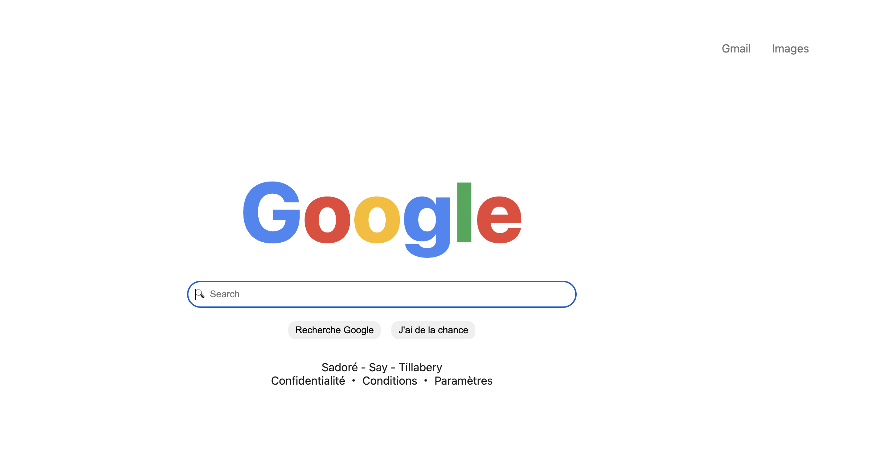

# 🌐 Google Home Page

Ce projet consiste à **recréer la page d’accueil de Google** en utilisant uniquement **HTML** et **CSS**.  
L’objectif est de s’exercer à la structuration d’une page web, à l’utilisation des balises sémantiques, à la mise en forme avec CSS, et à la reproduction fidèle d’une interface célèbre.

---

## 🧩 Fonctionnalités principales

- Structuration de la page avec les balises **`header`**, **`main`** et **`footer`**
- Affichage du logo Google stylisé à l’aide de texte et de styles CSS
- Création d’une **barre de recherche** accessible et de **boutons d’action**
- Ajout d’un **pied de page** avec des informations fictives
- Respect des bonnes pratiques d’**accessibilité** et de **responsive design**

Ce projet permet de consolider les bases du développement web tout en développant le sens du détail et la précision dans la reproduction d’interfaces.

---

## 🎯 Objectifs

- Découvrir la structure de base d’une page HTML  
- Utiliser les balises **HTML sémantiques**  
- Appliquer des styles **CSS** : lier une feuille de style externe et personnaliser l’apparence de la page  
- Mettre en place un **responsive design** pour adapter la page aux différents écrans  
- Structurer et organiser son code en séparant le contenu (HTML) et la présentation (CSS)

---

## 📋 Spécifications

- Structure **HTML** correcte  
- Respect de la **sémantique**  
- **Responsive design** fonctionnel  
- Séparation du contenu et du style  
- Code **propre**, **lisible** et **indenté**  

> 💡 Veuillez fournir un **lien GitHub Pages** en plus de votre **dépôt GitHub**.

---

## 🎨 Front-end Style Guide — Google Home Page

### 🧱 Layout

- The design is centered and responsive, adapting to different screen sizes.

### 🎨 Colors

**Primary:**

- Google Blue: `#4285F4`
- Google Red: `#EA4335`
- Google Yellow: `#FBBC05`
- Google Green: `#34A853`

**Neutral:**

- Background White: `#FFFFFF`
- Text Grey: `#202124`
- Link Grey: `#70757A`
- Hover Grey: `#F1F3F4`

### ✍️ Typography

- **Font Family:**  
  `system-ui, -apple-system, 'Segoe UI', Roboto, Arial, sans-serif`
- **Font Sizes:**  
  - Header Links: `16px`  
  - Google Logo: `120px`  
  - Search Input: `25px`
- **Font Weights:**  
  - Google Logo: `800`

### 🔍 Icons

- Search icon: 🔍 (emoji)
- (Optional) Microphone icon: 🎙️ *(emoji, currently commented out in HTML)*

---

## 🚀 Résultat attendu

Une reproduction fidèle et responsive de la **page d’accueil de Google**, réalisée uniquement avec **HTML et CSS**, hébergée sur **GitHub Pages**.

## Capture D'écran

## Lien de deployement sur github

https://idrissabelloissabii86.github.io/google-homepage/
