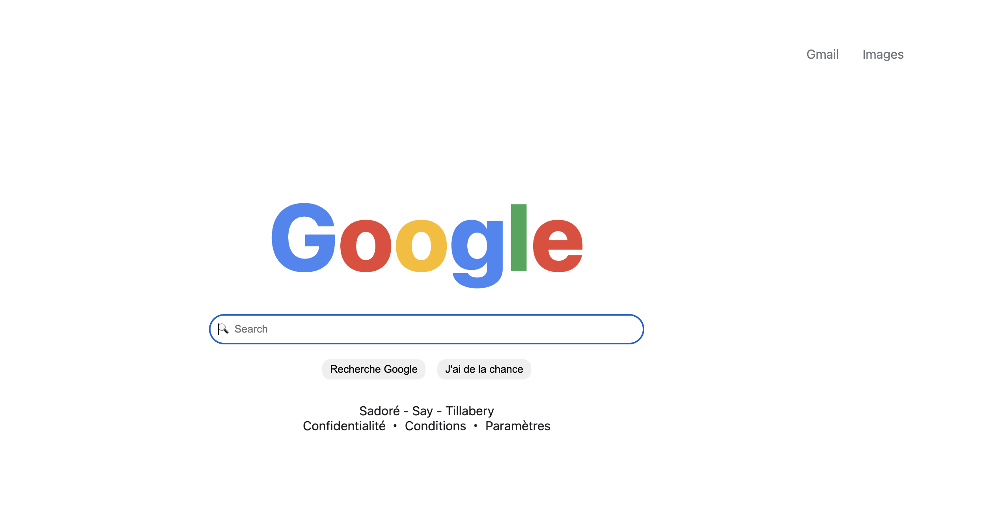

# DESCRIPTION

Ce projet est une reproduction de la page d’accueil de Google réalisée dans le cadre d’un exercice d’apprentissage du HTML et du CSS.
L’objectif principal est de pratiquer la mise en page, la structuration du code HTML, ainsi que l’utilisation du CSS pour recréer une interface fidèle au design original.

## Technologies utilisées

HTML et CSS

## Caractéristiques de la page

- Barre de recherche centrée comme sur la page originale

- Boutons “Recherche Google” et “J’ai de la chance” stylisés

- En-tête et pied de page inspirés de la version réelle du site

- Design responsive pour s’adapter aux différentes tailles d’écran

- Localisation dans le footer

## Ressources

<https://developer.mozilla.org/fr/docs/Learn_web_development/Core/Structuring_content>

<https://www.pierre-giraud.com/html-css-apprendre-coder-cours/>

## Capture D'écran

## Lien de deployement sur github

<https://idrissabelloissabii86.github.io/google-homepage/>
